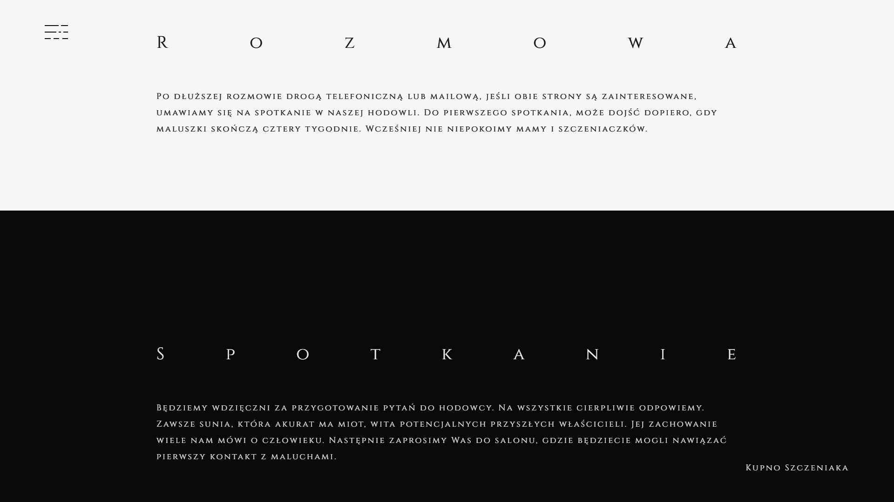

<br />
<br />

# La Mia Passione Maltese - Website for my parents maltese breeding 🐶

https://lamiapassionemaltese.pl/

<br />

### About Project

My parent's had a website but it was made by my father in something like wordpress so... UI and UX wasn't really friendly and it looked like taken from 2000 year. Also some things just didn't work. It's a one page website so it's pretty simple. There is a couple of basic sections like: "About us", "Our dogs", "Exhibitions", "Buying process", "Faq" and of course "Contact". My main goal was to make it interesting and vivid. Personally I think that a good website is a website which will drill into your mind for a while.

<br />

## Used Technologies
* React - version 17.0.2
* TypeScript - version 4.5.5
* React-router-dom - version 5.2.0
* Styled-components - version 5.3.3
* Framer-motion - version 4.1.17
* Email.js - version 3.2.0
* React-intersection-observer - version 8.32.1
* React-scroll - version 1.8.4

<br />

## Features

- Images has parallax effect after hovering their parents container
- Toggle between different years in "Exhibitions section"
- Toggle answers in "Faq section"
- Email sending with form validation


<br />

## How to run?

1. Clone the project

```bash
  git clone https://github.com/BlackAndWhiteCarnage/La-Mia-Passion-Maltese
```

2. Install dependencies

```bash
  npm install
```

3. Run project

```bash
  npm start
```

<br />

## Quick Preview

### Home Page


### About Us


### Our Dogs


### Exhibitions


### Buying process


### Faq


### Contact


<br />

## Author

- [@BlackAndWhiteCarnage](https://github.com/BlackAndWhiteCarnage)
